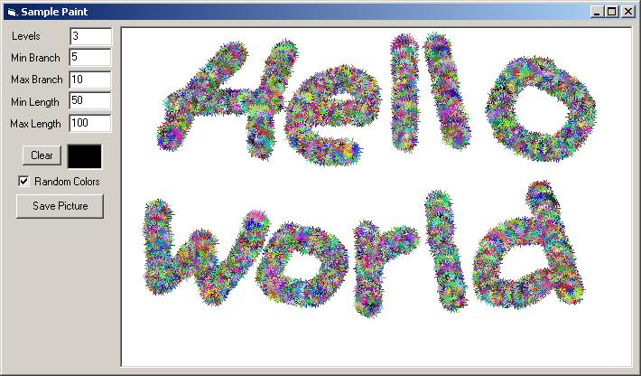



## Paint Tool \- Using Recursive Algorithm

### Description

This program demonstrates a recursive function to create a tool for Paint...

The following are the inputs:

Levels = Specifies how far the recursion will flow.

Min Branch = Specifies the minimum randomized branches.

Max Branch = Specifies the maximum randomized branches.

Min Length = Specifies the minimum randomized length of each branch

Max Length = Specifies the maximum randomized length of each branch

The recursive function somewhat reflects the concept of a tree structure. So, the size of the brush depends on the length per branch...
 
### More Info
 

             |
---                |---
**Submitted On**   |2007-10-01 21:50:02
**By**             |[Ronald Borla](https://github.com/Planet-Source-Code/PSCIndex/blob/master/ByAuthor/ronald-borla.md)
**Level**          |Intermediate
**User Rating**    |5.0 (10 globes from 2 users)
**Compatibility**  |VB 6\.0
**Category**       |[Graphics](https://github.com/Planet-Source-Code/PSCIndex/blob/master/ByCategory/graphics__1-46.md)
**World**          |[Visual Basic](https://github.com/Planet-Source-Code/PSCIndex/blob/master/ByWorld/visual-basic.md)
**Archive File**   |[Paint\_Tool2085561012007\.zip](https://github.com/Planet-Source-Code/ronald-borla-paint-tool-using-recursive-algorithm__1-69424/archive/master.zip)

